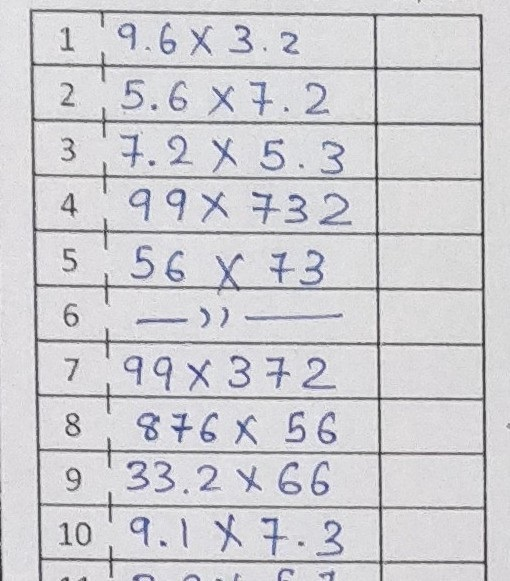
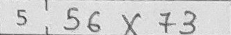
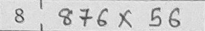

#### Crop Cells From Table Images

Hello Folks! this project is based on OpenCV and Python with the following codes you can  automatically crop out Cells / Boxes from image of data tables.

It automatically recognizes horizontal and Vertical lines from images
and Crop Boxes i.e, ( Cells of the given Table in our case).

>simply Run the "crop_boxes.py" and it will crop out each boxes line by line for you cropped out images will be stored in "cropped" directory.

#### Required Modules

`````python
>> pip install opencv-contrib-python
>> pip install numpy
`````

#### Illustrations

> Input Image: ``sample_image.jpg``
>
> 


> Detecting Vertical Lines
>
> 
>
> Detecting Horizontal Lines
>
> 
>
> Combined Mask
>
> 
>
> Final Detected Table
>
> 


#### Output

> All the cropped Boxes / Cells are stored in ``cropped`` Directory
>
> 
>
> 
>
> 
>
> 
>
> 
>
> 
>
> 
>
> 
>
> 
>
> 

