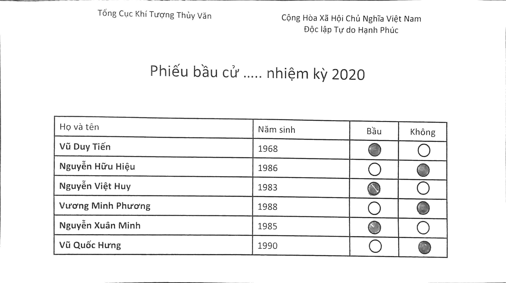
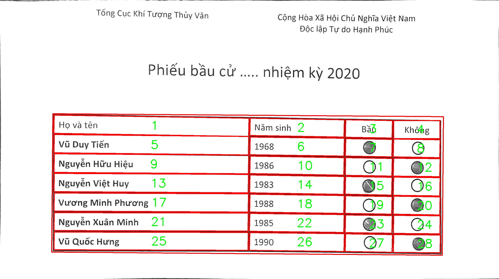

## Cell Extractor

This is a solution to one of the [**issues**](https://github.com/imneonizer/Crop-Rows-From-Tables-using-OpenCV-and-Python/issues/1) raise by github user [**@shinnobi**](https://github.com/shinnobi) who wanted to extract all the cells from a table.

Using the same technique with a little bit of modification, it can be achieved, since the cells are being cropped so it will be difficult to keep track of which cropped cell belongs to which position so for the convenience I saved the first image as a mapping for other cropped cells. 

**Input Image**

**Output**

cropped cells are stored inside ``cropped`` directory.

